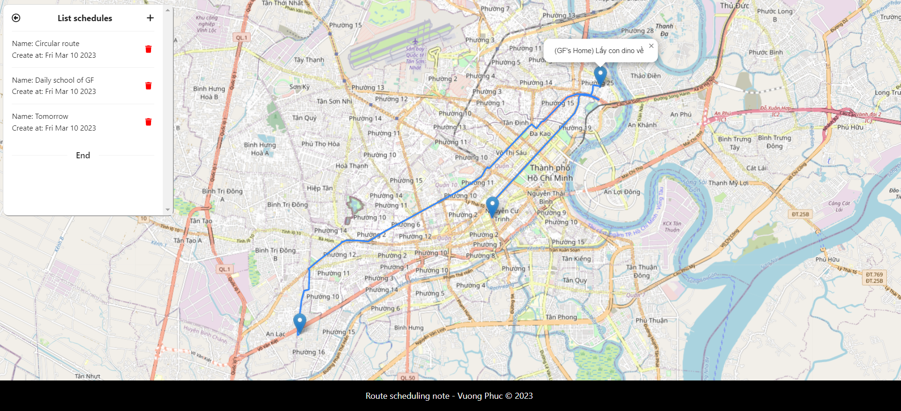

# Route scheduling with note

<span>
    
    
    
    
</span>

## Introduction

An application that you can persist your places on a maps and route your schedules. Moreover, you can stick a small note to each place in the schedule as you want.

## Usage

### Backend server

Firstly, you need to add a small piece of configuration before starting the backend server. Please go to [resource](src/backend/src/main/resources/), then create a file named `secret.properties` with the following content:

```
ors.api_key=<YOUR_ORS_API_KEY>
```

Where the `<YOUR_ORS_API_KEY>` can get from the [Open Route Service](https://openrouteservice.org/). This will help the backend use the map APIs. Then, you can start your backend server with [IntelliJ](https://www.jetbrains.com/idea/), or manually by [Maven script](src/backend/mvnw).

### Frontend web

Afterward, you need to install all the required libraries in [NodeJS package](src/frontend/package.json) by typing:

```bash
npm install
```

Lastly, you can start your frontend with:

```bash
npm start
```

Enjoy the application!

## Gallery

<p align="center">
    
</p>
<p align="center">
    <b>Scheduling screen</b>
</p>

## Contribution

This is a side-project which has been done by [phuc16102001]() to learn [Java Spring](https://spring.io/). 

You are available to use it as a reference.

## License

[MIT](LICENSE)
